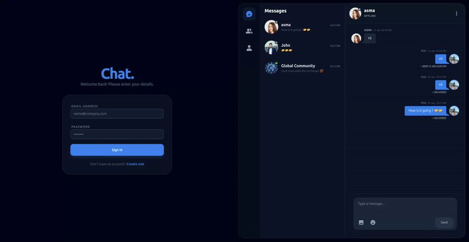
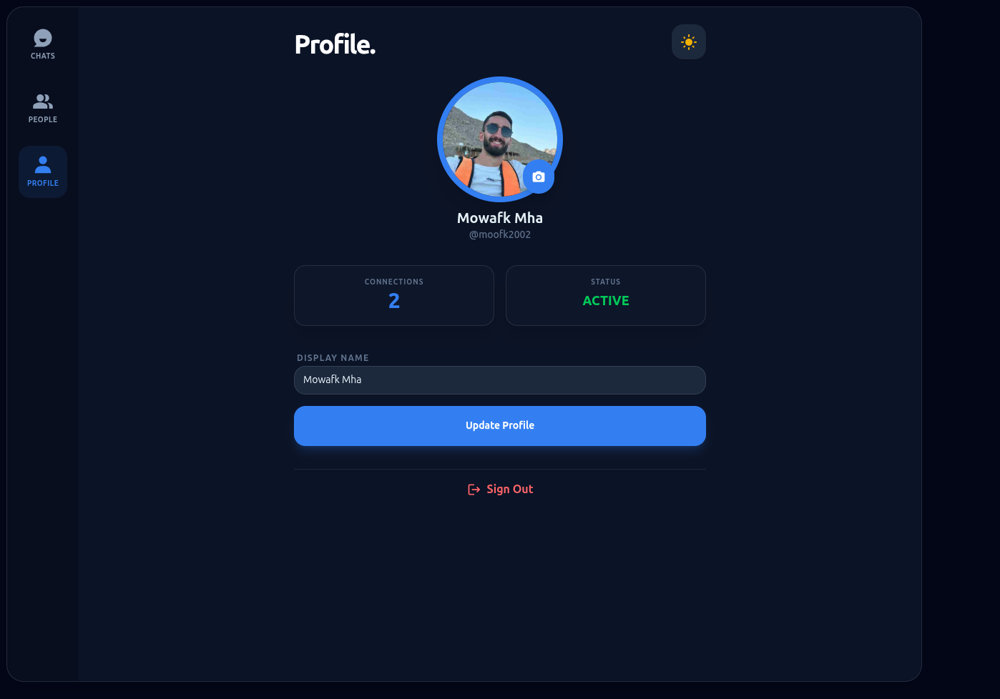
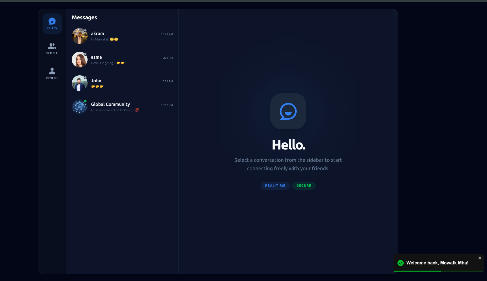
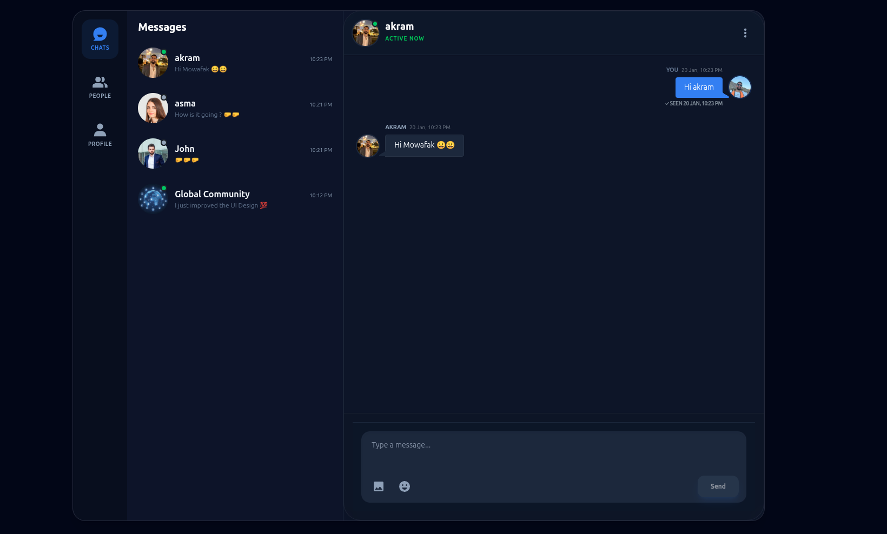
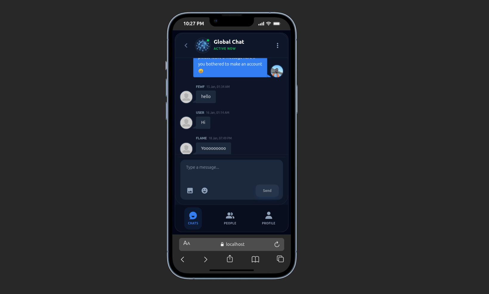
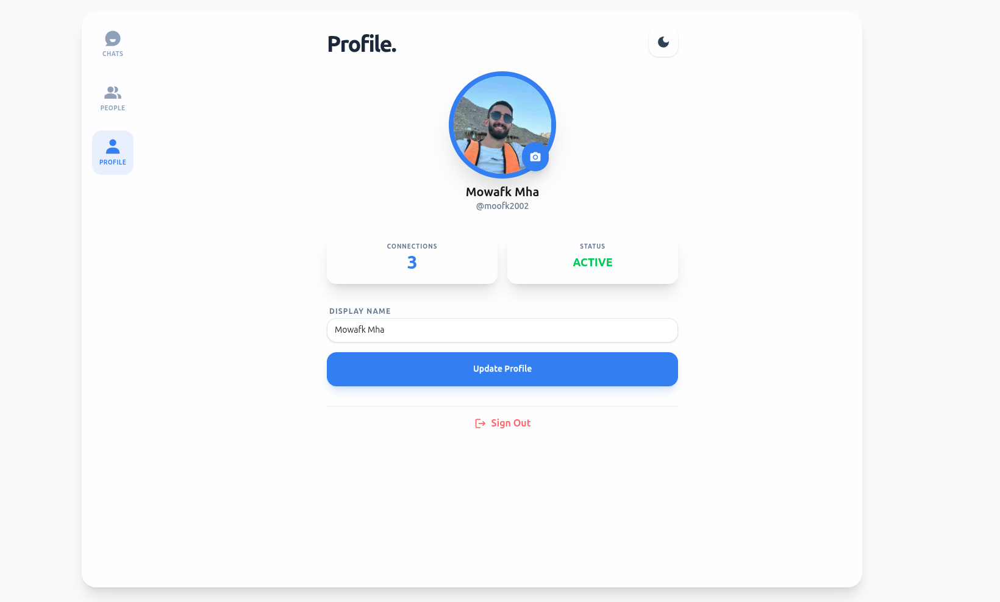

full-stack chat application built for real-time communication. This project is part of my full stack learning journey 

<video src="./project-images/video.webm" width="100%" controls autoplay loop muted></video>

