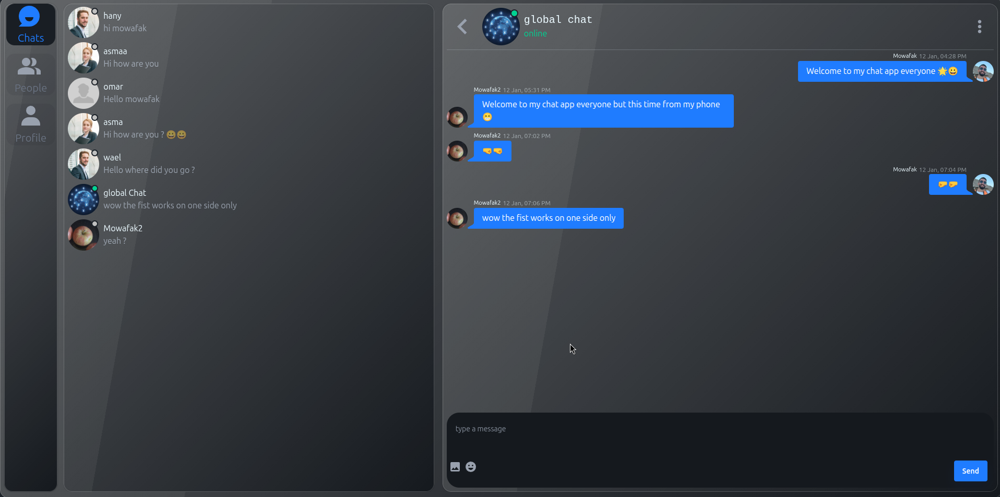
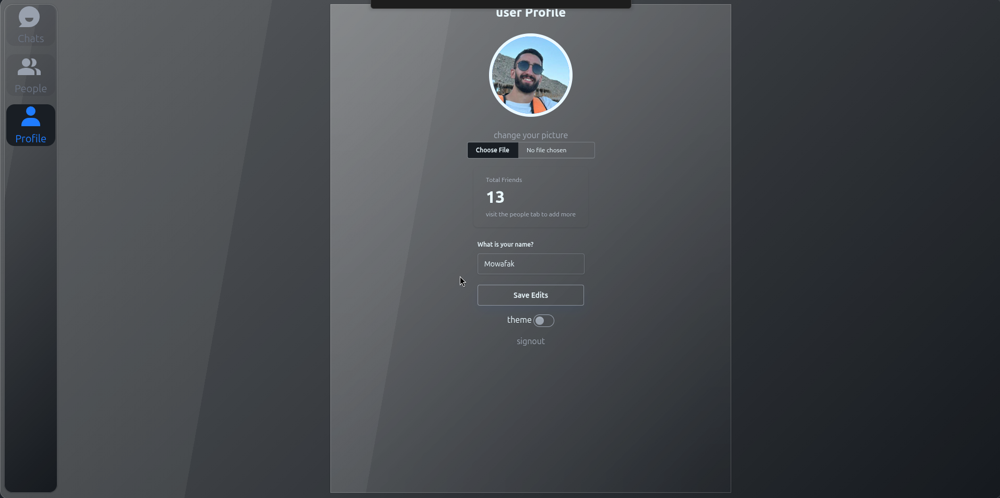

# 💬 Real-Time Chat Application

full-stack chat application built for real-time communication. This project is part of my full stack learning journey 

## 🛠 Tech Stack

**Frontend:**

**Backend:**

**Database & Storage:**

---

## ✨ Key Features

### 🟢 Real-Time Online Status and Seen messages
global chat and a private chat 
### 👥 Friend System
Connect and manage your network.
Search for users and send friend requests.
### customize profile 
upload and crop profile image
dark and light theme mode 
---
